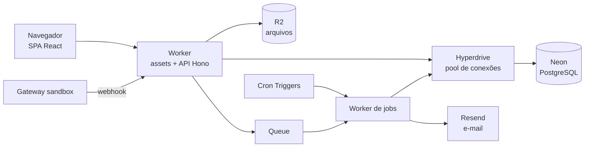
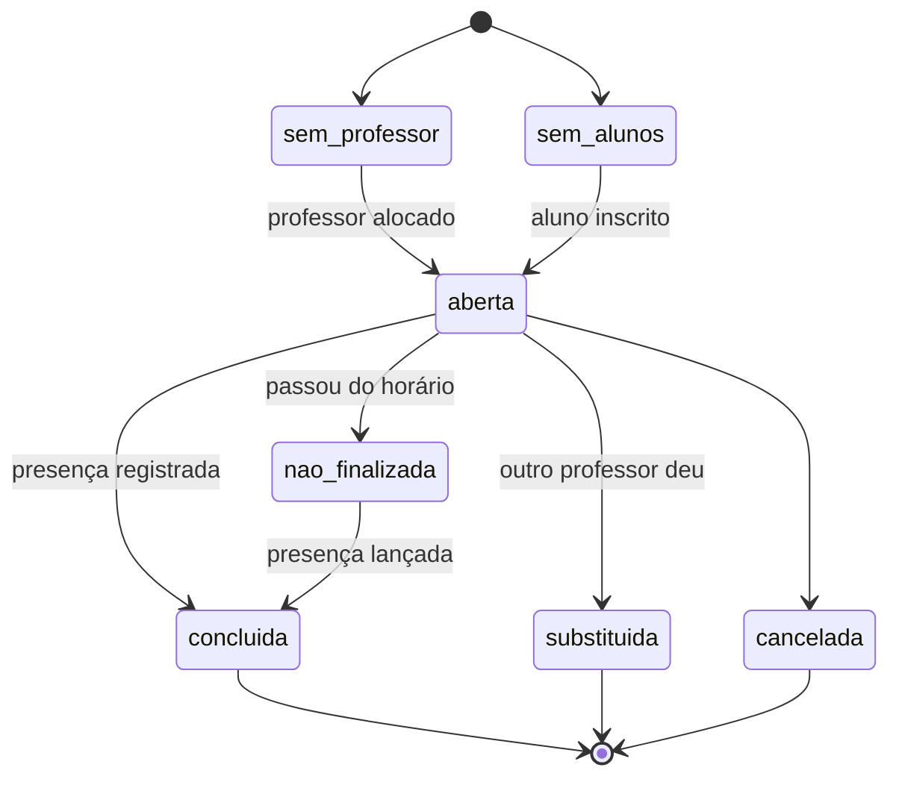

# Classa: plano de arquitetura

17/09/2026 · referência: protótipo HTML de navegação (sem servidor, ~8.500 linhas de JS), mantido fora do repositório

Recomendação: um monólito modular em TypeScript. A API Hono roda em Cloudflare Workers, o banco é PostgreSQL (Neon em produção, Docker no local), os arquivos ficam no R2 e os dados de exemplo são 100% sintéticos. Qualquer pessoa clona o repositório e sobe tudo com um comando.

Princípio de produto: nada de dado fixo no código. Alunos, matrículas, professores, turmas, cursos e usuários são cadastrados pelas telas (ou pela API). O seed só existe para gerar uma escola de demonstração e os testes, e o sistema funciona com o banco vazio.

## 1. O que o protótipo já define

O HTML é uma SPA sem servidor com dados em memória. Ele já resolve a parte difícil: o domínio, os perfis e as regras. O trabalho é transformar isso em banco, API e testes.

| Módulo | O que faz no protótipo |
| --- | --- |
| Dashboard | 15 blocos personalizáveis: aulas de hoje, pendências da semana, ocupação por curso, alunos por situação, consumo do pacote, presença em 30 dias, carga por professor |
| Agenda | Visões mensal, semanal, diária e kanban; detalhes da aula, presença, troca de professor, eventos e reuniões, feriados, modo apresentação |
| Cursos | Catálogo, tipos (grupo, particular, híbrido, workshop, turmas dedicadas), módulos, regras, currículo e grade semanal |
| Alunos | Lista, ficha com abas, matrículas, saldo de aulas, renovação, alertas, histórico |
| Professores | Ficha, habilitação por curso e módulo, disponibilidade, carga semanal, folha de pagamento |
| Empresas | Contas B2B (empresa paga tudo) e B2B2C (subsídio da empresa + desconto ao colaborador), licenças, relatório ao RH |
| Ações | 8 fluxos em kanban: substituição, mudança de nível, reposição, admissão de professor, cobrança, renovação, campanhas, cancelamento e retenção |
| Relatórios | Por área, incluindo dashboard financeiro (receita reconhecida, custo de professores, carteira a reconhecer, parcelas) |
| Auditoria | Histórico de alterações filtrável por entidade e autor |
| Configurações | Usuários, perfis e acessos, parâmetros, políticas, alertas |
| Área do aluno | Minha área, minha agenda, histórico de aulas |

Há ainda telas de Consultoria (diagnóstico até kickoff) e Material (gerador, revisão, biblioteca) que ficam fora do MVP.

## 2. Stack

Tudo tem plano gratuito ou roda local. Limites de free tier mudam: confira a página de preços de cada serviço antes de depender de um número.

| Camada | Escolha | Por quê | Alternativa |
| --- | --- | --- | --- |
| Monorepo | pnpm workspaces + Turborepo | Tipos e regras compartilhados entre web, API e testes | Nx |
| Frontend | React + Vite + TanStack Router/Query + Tailwind + shadcn/ui | Backoffice logado não precisa de SSR; vira arquivos estáticos servidos pelo Worker | Next.js na Vercel |
| API | Hono em Cloudflare Workers + Zod | Mesmo código em `wrangler dev` e produção; cliente tipado via `hono/client` | Fastify em container |
| Banco | PostgreSQL: Neon (produção), Docker (local), Hyperdrive no meio | Transações, constraints, RLS e `EXCLUDE` para impedir aula sobreposta no próprio banco | Supabase; D1 se quiser 100% Cloudflare |
| ORM e migrations | Drizzle ORM + drizzle-kit | SQL explícito, migrations versionadas em arquivo | Prisma |
| Autenticação | Better Auth (sessões no Postgres, MFA por TOTP) | Sem serviço pago; o protótipo já exibe MFA por usuário | Clerk, Supabase Auth |
| Arquivos | Cloudflare R2 com URL pré-assinada | Materiais, contratos, currículos de candidatos, exportações LGPD | Supabase Storage |
| Tarefas assíncronas | Cron Triggers + Queues (ou tabela outbox + cron) | Gerar grade do ciclo, lembretes, vencimentos, fila de renovação, fechar aulas não finalizadas | pg-boss em container |
| E-mail | Resend (produção), Mailpit (local) | Convite de usuário, recuperação de senha, relatório ao RH | Brevo |
| Sala online | Link do Jitsi Meet gerado por aula | Substitui as contas Zoom do protótipo sem custo | Zoom API |
| Pagamentos | Asaas sandbox (PIX e boleto) ou Stripe test mode | Pratica webhook e idempotência sem dinheiro real | Mercado Pago sandbox |
| Observabilidade | Workers Logs + Sentry (free) | Erro com stack trace e usuário/escola no contexto | Grafana Cloud |
| CI/CD | GitHub Actions + deploy com wrangler; preview por PR | Lint, typecheck, testes com Postgres, migrations, deploy | Cloudflare Workers Builds |
| Testes | Vitest (domínio e API) + Playwright (e2e por persona) | As personas de teste do protótipo viram a matriz de testes de permissão | Jest + Cypress |

## 3. Arquitetura

Um deploy de Worker serve a SPA e a API. O domínio fica em módulos dentro da API, não em microserviços: um projeto de uma pessoa não ganha nada com rede entre serviços.



Cada módulo da API tem três camadas:

- **domain**: regras puras em TypeScript, sem banco nem HTTP (estado da aula, consumo de crédito, cálculo da folha). É onde a lógica do protótipo é portada, com testes unitários.
- **application**: casos de uso (`matricularAluno`, `fecharFolha`) que abrem transação, checam permissão, chamam o domínio e gravam auditoria.
- **http**: rotas Hono, validação Zod, serialização.

## 4. Modelo de dados

Oito contextos. Toda tabela leva `tenant_id` (a escola), então o mesmo banco atende várias escolas desde o início.

| Contexto | Tabelas principais |
| --- | --- |
| Identidade | tenant, person, user_account, session, area, access_profile, user_area_access (nível, recorte), permission_verb |
| Acadêmico | course_type, course (regras), module, curriculum, curriculum_item, room, class_group |
| Agenda | offering (oferta recorrente), lesson (instância), lesson_student, attendance, lesson_override, calendar_event, holiday |
| Pessoas | student, teacher, teacher_qualification, teacher_availability, candidate |
| Comercial | lead, enrollment, credit_ledger, company, company_contract, company_member |
| Financeiro | billing_contract, installment, payment, refund, payroll_period, payroll_line |
| Operação | workflow, workflow_card, workflow_transition, alert, feedback |
| Auditoria | audit_log (append-only: autor, entidade, ação, antes, depois, justificativa) |

Convenções:

- IDs em UUIDv7 (ordenáveis por tempo, seguros para expor na URL).
- Dinheiro em centavos (`integer`), nunca `float`.
- Datas em `timestamptz`; o fuso fica em `tenant.timezone`.
- Saldo de aulas é a soma do `credit_ledger`. Ajuste vira lançamento novo, nunca edição.
- Nada é apagado: o registro ganha `deactivated_at`, como o protótipo já faz com alunos.
- Conflito de horário é barrado pelo banco:

```sql
CREATE EXTENSION IF NOT EXISTS btree_gist;

ALTER TABLE lesson ADD CONSTRAINT lesson_teacher_no_overlap
  EXCLUDE USING gist (
    tenant_id  WITH =,
    teacher_id WITH =,
    tstzrange(starts_at, ends_at) WITH &&
  ) WHERE (state <> 'cancelada');
```

## 5. Perfis e acesso

O protótipo usa um modelo de três eixos, e vale manter: **hierarquia** diz o que a pessoa pode fazer, **área** diz onde, **escopo** diz sobre quais registros.

| Eixo | Valores no protótipo | Implementação |
| --- | --- | --- |
| Hierarquia | Administrador, Gestor, Editor, Colaborador, Visualizador × 8 ações (visualizar, criar, editar, editar próprios, inativar, excluir, usuários, configurações) | Tabela de níveis; middleware `can(user, acao, recurso)` |
| Área | Administrativo, Comercial, Pedagógico, Acadêmico, CX, Financeiro/Fiscal, Marketing; acesso total ou restrito a um recorte de telas | `user_area_access` com lista de chaves de tela e aba |
| Escopo | Toda a instituição, própria carteira, próprias empresas, próprias aulas | Row-Level Security no Postgres com `SET LOCAL app.user_id` por transação |
| Verbos sensíveis | Estornar, cancelar matrícula, corrigir presença, ajustar créditos, exportar dados pessoais | Exigem justificativa e sempre geram linha em `audit_log` |

Como ficam os papéis: **Admin** e **Diretor** são nível Administrador em todas as áreas; **Coordenador** é Gestor na área Pedagógica; **Professor** é prestador com escopo "próprias aulas"; **Aluno** só enxerga a área do aluno.

O servidor é a autoridade. O frontend usa a mesma função de política só para esconder menus e botões.

## 6. Regras de negócio críticas

São as regras que o protótipo já calcula e que precisam de teste antes de qualquer tela.



### Aluno e matrícula

- Situações: Ativo, Suspenso, Congelado, Inadimplente, Cancelado, Inativo.
- Cada aula dada debita um crédito do pacote. A partir de 80% consumido, o aluno entra no alerta de renovação.
- Contratos que vencem em até 60 dias entram na fila de renovação.

### Regras por curso (configuráveis; valores iniciais do protótipo)

- Vagas: 8 em grupo, 1 em particular.
- Duração: 45, 50 ou 60 minutos. Pacote: 32, 36 ou 48 aulas.
- Cancelamento sem perder a aula: 6 h antes em grupo, 24 h em particular.

### Alocação de professor

- Precisa estar habilitado no curso e, se houver recorte, no módulo ou turma.
- Precisa estar dentro da disponibilidade e abaixo do teto semanal (24 aulas no protótipo).
- Não pode ter duas aulas sobrepostas (constraint no banco).

### Folha de professores

- Aula com presença ou com falta do aluno é paga. Aula com pedido de suporte é descontada. Cancelada não entra.
- Aula não finalizada trava o fechamento do mês.
- O substituto recebe a aula que deu. Valor = valor hora × duração; particular tem valor fixo por alocação.

### Financeiro

- Receita reconhecida = aulas dadas × alunos da aula × valor da aula. Em turma dedicada, o valor é por turma.
- Matrícula vira contrato em 6 parcelas com vencimento no dia 10.
- B2B: empresa paga 100%. B2B2C: empresa paga um percentual e o colaborador paga o resto com desconto.
- Webhook de pagamento é idempotente: a mesma notificação duas vezes não baixa a parcela duas vezes.

## 7. Reprodutibilidade

Critério de pronto: alguém clona o repositório numa máquina limpa e tem o sistema rodando, com login de cada perfil, em menos de 10 minutos.

```bash
git clone https://github.com/<voce>/<projeto>.git
cd <projeto>
corepack enable && pnpm install
cp .env.example .env
pnpm dev:up      # docker compose: Postgres 17 + Mailpit
pnpm db:reset    # migrations + seed determinístico
pnpm dev         # web + API em wrangler dev (R2 e Queues simulados localmente)
```

- **Versões travadas**: `.node-version`, campo `packageManager`, `pnpm-lock.yaml`, tags fixas das imagens Docker.
- **Seed determinístico**: Faker pt_BR com semente fixa gera sempre a mesma escola fictícia, com uma persona de teste por perfil.
- **Migrations em arquivo**: o banco de produção só muda por migration que passou no CI.
- **Segredos**: `.env.example` no repositório; valores reais em `wrangler secret` e GitHub Secrets.
- **CI usa o mesmo compose**: o que passa local passa no Actions.
- **Devcontainer** opcional, para abrir no Codespaces sem instalar nada.
- **ADRs** em `docs/adr/`: por que Postgres e não D1, por que monólito modular.

## 8. Escalabilidade

O free tier aguenta uma demo e algumas escolas pequenas. O objetivo é que crescer exija trocar de plano, não reescrever.

### Já nasce assim

- Workers sem estado escalam sozinhos; conexões com o banco passam pelo pool do Hyperdrive.
- Multi-escola por `tenant_id` + RLS.
- Aulas materializadas por ciclo (o protótipo gera na leitura). Índices em `(tenant_id, starts_at)` e `(teacher_id, starts_at)`.
- Paginação por cursor em listas grandes (alunos, auditoria).
- Dashboard e relatórios leem visões materializadas atualizadas por cron.
- Tarefas pesadas (gerar grade, fechar folha, exportar) vão para fila e avisam quando terminam.

### Só quando os números pedirem

- Particionar `lesson` e `audit_log` por mês.
- Arquivar auditoria antiga no R2.
- Réplica de leitura para relatórios.

### Fora do plano

Microserviços, Kubernetes, event sourcing e GraphQL. Custam mais do que resolvem neste tamanho.

## 9. Dados no repositório público

O protótipo de referência não é versionado. Todo dado que aparece no Classa é fictício.

- Não commitar o protótipo nem arquivos exportados de planilhas ou sistemas reais.
- Projeto, cursos, módulos, pessoas e empresas têm nomes fictícios.
- Todo dado de exemplo sai do seed sintético, incluindo CNPJs e CPFs de teste.
- Secret scanning e push protection ativos no GitHub; gitleaks no CI.
- `LICENSE` (MIT), `SECURITY.md` e aviso no README de que os dados são fictícios.

## 10. Estrutura do repositório

```text
.
├── apps/
│   ├── web/                 # React + Vite (SPA)
│   ├── api/                 # Hono no Worker
│   │   └── src/modules/
│   │       ├── identity/    # domain/ application/ http/
│   │       ├── academic/
│   │       ├── schedule/
│   │       ├── people/
│   │       ├── commercial/
│   │       ├── finance/
│   │       ├── operations/
│   │       └── audit/
│   └── jobs/                # consumidor de fila + cron
├── packages/
│   ├── db/                  # schema Drizzle, migrations, seed
│   ├── domain/              # regras puras compartilhadas
│   ├── contracts/           # schemas Zod da API
│   ├── policy/              # função can() usada por API e web
│   └── ui/                  # componentes shadcn
├── e2e/                     # Playwright por persona
├── infra/
│   ├── docker-compose.yml
│   └── wrangler.jsonc
├── docs/adr/
├── .github/workflows/ci.yml
└── .env.example
```

## 11. Roadmap por fases

Cada fase termina com algo usável no ar. A ordem segue a dependência: não há agenda sem cursos, nem folha sem agenda.

| Fase | Entrega | Pronto quando |
| --- | --- | --- |
| 0 · Fundação | Monorepo, compose, CI, auth, tenant, auditoria base, deploy vazio | Clone limpo sobe login; CI verde; URL pública responde |
| 1 · Cadastros | Pessoas, alunos, professores, cursos, módulos, salas, usuários e perfis | Cada persona vê só o que deve; testes de permissão passam |
| 2 · Agenda | Ofertas, geração da grade, aulas, presença, substituição, feriados | Professor registra presença; aula sobreposta é recusada pelo banco |
| 3 · Comercial | Leads, matrícula, créditos, renovação, empresas B2B e B2B2C | Aula dada debita crédito; fila de 60 dias aparece |
| 4 · Financeiro | Parcelas, pagamento em sandbox, folha de professores | Webhook baixa parcela uma vez; aula não finalizada trava a folha |
| 5 · Operação | Fluxos kanban, alertas, dashboard, relatórios | Dashboard com os 15 blocos lendo agregados |
| 6 · Vitrine | Área do aluno, README com GIFs, demo pública com login por perfil | Visitante entra como coordenador em 1 clique |

## 12. Perguntas em aberto

- ~~Nome do projeto~~: **Classa**. Falta definir os nomes fictícios dos cursos da demo.
- Postgres (Neon) como recomendado, ou 100% Cloudflare com D1, abrindo mão de RLS e `EXCLUDE`?
- O MVP inclui CX, Marketing, Consultoria e Material, ou só as fases 0 a 4?
- Manter português, inglês e espanhol desde o início, como o protótipo?
