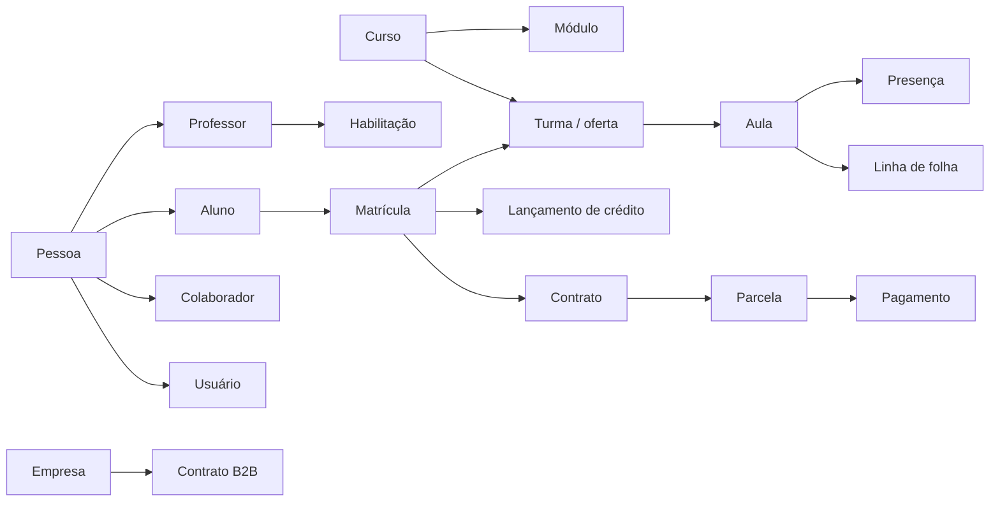
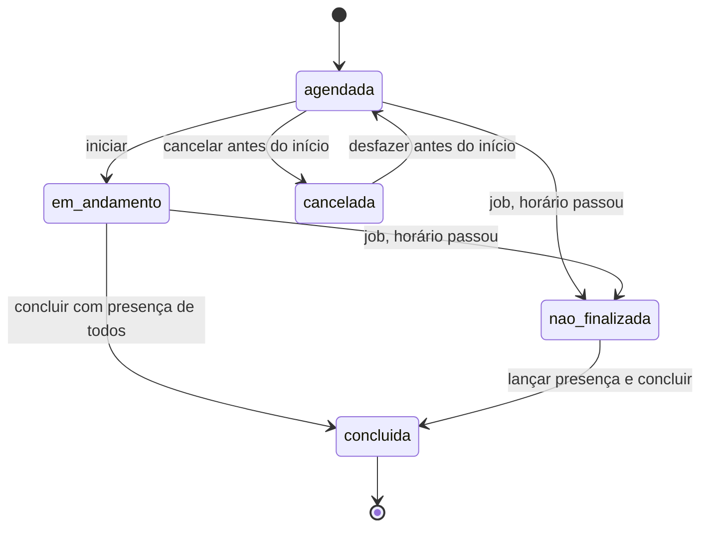

# Classa: modelo de domínio

17/09/2026 · derivado da leitura completa do protótipo de navegação (fora do repositório)

Este documento é a fonte da verdade das entidades, relações e regras do Classa. Cada parte nova do sistema é conferida contra ele antes de ser construída.

O protótipo é uma SPA sem servidor. Ele define bem as telas e a intenção das regras, mas liga tudo por nome, recalcula dados a cada leitura e gera parte do que mostra por fórmula. As regras abaixo separam três coisas:

- **Do protótipo:** regra que roda no protótipo e vem igual.
- **Corrigido:** regra que o protótipo declara mas não aplica, ou aplica de forma inconsistente, e que o Classa aplica de verdade.
- **Decisão:** ponto em aberto. Tem uma proposta padrão e está listado em [Decisões em aberto](#decisões-em-aberto).

## 1. Princípios

1. **Ids, nunca nomes.** Toda relação usa id. Renomear curso, aluno ou professor não quebra nada.
2. **Nada é recalculado para trás.** Aula gerada, contrato emitido, parcela, presença e folha fechada são gravados. Mudar o valor da aula hoje não muda parcela já emitida.
3. **Nada some.** Registro de negócio ganha `deactivated_at`. Exclusão física só existe como anonimização (LGPD).
4. **Toda escrita audita.** Autor, data, entidade, ação, antes e depois. Ações sensíveis exigem justificativa.
5. **Regras no servidor.** A tela esconde botões, mas quem decide é a API.
6. **Dados reais nunca vão ao repositório.** O importador do protótipo roda só na máquina local.

## 2. Mapa das entidades

As tabelas completas de cada contexto estão nas seções seguintes.

## 3. Pessoas

### 3.1 Pessoa
Ficha única. Aluno, professor, colaborador e usuário apontam para ela.

| Campo | Regra |
| --- | --- |
| nome | obrigatório, 2 a 120 caracteres |
| e-mail | opcional; **único por escola** quando preenchido (**corrigido**) |
| CPF | opcional; guardado só com dígitos, dígito verificador validado, **único por escola** (**corrigido**) |
| telefone | opcional, só dígitos |
| data de nascimento | opcional |

Ao cadastrar com CPF ou e-mail que já existem, o sistema oferece usar a pessoa existente em vez de duplicar. O protótipo prometia isso e não fazia (**corrigido**).

### 3.2 Aluno
| Campo | Regra |
| --- | --- |
| pessoa | obrigatório |
| situação | `ativo`, `suspenso`, `congelado`, `inadimplente`, `cancelado`, `inativo` (do protótipo) |
| situação anterior | guardada ao desativar ou cancelar, para reativar voltando a ela |
| empresa | opcional. Sem empresa = B2C |
| disponibilidade | horas da semana (ver 5.6) |

Transições:
- **Desativar** (Gestor ou acima): situação vira `inativo`, guarda a anterior. **Reativar** volta à anterior.
- **Cancelar** (fluxo de retenção ou ação direta com justificativa): situação `cancelado` **e encerra as matrículas ativas** (**corrigido**: o protótipo só mudava o rótulo).
- **Inadimplente:** entra quando uma parcela passa de N dias vencida (política da escola, padrão 15) e sai quando não há mais parcela vencida (**decisão D8**). No protótipo era só manual.
- `suspenso`, `congelado` e `inadimplente` bloqueiam novos agendamentos quando a política estiver ligada.

### 3.3 Professor
| Campo | Regra |
| --- | --- |
| pessoa | obrigatório |
| ativo | inativo não recebe aula nova e sai dos seletores |
| teto semanal | aulas por semana, padrão 24. Passar do teto é **aviso** (do protótipo) |
| valor hora | R$, visível só para quem vê valores (ver 7.3) |
| habilitações | por curso, com recorte opcional por módulo ou turma |
| disponibilidade | horas da semana |

Regras de habilitação (do protótipo):
- Habilitado = ativo **e** curso habilitado **e** (sem recorte **ou** item dentro do recorte).
- Ligar um curso habilita todos os itens. Recortar todos os itens remove o curso.
- Não se tira habilitação de curso ou turma em que o professor é titular. É preciso trocar o titular antes.

### 3.4 Colaborador e usuário
- **Colaborador:** pessoa com cargo e departamento. Pode existir sem acesso ao sistema.
- **Usuário:** credencial de acesso que sempre nasce de uma pessoa. Detalhes em [7. Acesso](#7-acesso).

## 4. Catálogo

### 4.1 Curso *(já construído)*
Tipos: `grupo`, `particular`, `hibrido`, `workshop`, `turmas_dedicadas`. O tipo não muda depois de criado.

| Regra | Padrão por tipo | Aplicação |
| --- | --- | --- |
| alunos por aula | particular 1; grupo 8; turmas 25 | **bloqueia** matrícula acima das vagas (**corrigido**, **decisão D6**) |
| duração (min) | 45 grupo; 50 turmas; 60 particular | fim da aula = início + duração |
| aulas no pacote | 48 grupo; 36 turmas; 32 particular | pré-preenche a matrícula |
| antecedência para cancelar (h) | 6; particular 24 | define se o cancelamento debita crédito |
| valor da aula (R$) | 60; turmas 400; particular 140 | base do contrato e da receita |
| modalidades | online, presencial | a matrícula escolhe uma das aceitas |

Também vêm do protótipo, e ainda faltam no Classa:
- `auto_agenda`: o aluno pode agendar sozinho ou só a secretaria.
- `exige_disponibilidade`: a alocação individual bloqueia fora da disponibilidade do aluno.
- idioma.

### 4.2 Módulo *(já construído)*
Só em cursos `grupo` e `turmas_dedicadas`. Tem ordem, nome e cor. O **módulo individual** dentro de um curso em grupo, que o protótipo identificava pelo nome, vira um campo `individual` no módulo.

### 4.3 Sala
| Campo | Regra |
| --- | --- |
| nome | único por escola |
| tipo | `virtual`, `presencial`, `auditorio` |
| link | obrigatório em sala virtual. Pode ser fixo ou gerado por aula |
| capacidade | opcional |
| ativa | |

**Corrigido:** a mesma sala não pode ter duas aulas sobrepostas (constraint no banco).

### 4.4 Currículo
- Currículo de **produto** (sequência ligada a módulos ou turmas) ou **acervo** (biblioteca avulsa, sem ordem).
- Versões: `rascunho` → `publicada`. As aulas só leem a publicada. Existe no máximo um rascunho. Publicar exige ao menos 1 conteúdo.
- Conteúdo: título, formato (`interativa` ou `simples`), gramática, vocabulário e links de pré-aula, aula e pós-aula.
- A aula recebe o conteúdo *i* da sequência na *i*-ésima aula do módulo ou turma e **grava qual recebeu**.
- Cada módulo aceita um único currículo de produto.

## 5. Agenda

### 5.1 Turma / oferta
É o que se repete toda semana e gera as aulas. O protótipo tinha dois modelos, turma dentro do curso e oferta calculada. O Classa unifica os dois em **turma**:

| Campo | Regra |
| --- | --- |
| curso, módulo | módulo obrigatório se o curso tem módulos |
| nome | ex.: "Turma 3 · noite" |
| professor titular | precisa estar habilitado e ativo (**corrigido**) |
| sala | precisa aceitar a modalidade |
| modalidade | online ou presencial |
| vagas | padrão = alunos por aula do curso |
| horários | lista de (dia da semana, hora de início com minutos) |
| período | início e fim. **Aulas só são geradas dentro dele** (**corrigido**) |

A aula particular (curso particular ou módulo individual) é uma turma de 1 vaga criada na alocação da matrícula.

### 5.2 Geração das aulas
- Um job gera as aulas de cada turma para as próximas N semanas (padrão 8) e grava cada uma.
- Não gera no domingo, em feriado ou recesso, nem fora do horário de funcionamento da escola (**corrigido**: o protótipo declarava o horário mas não aplicava).
- Mudar horário, professor ou sala da turma afeta só aulas futuras ainda não iniciadas. Aula passada nunca muda.
- Feriados nacionais são importados por ano (Páscoa: Carnaval −48 e −47, Sexta-feira Santa −2, Corpus Christi +60, mais as datas fixas). Recesso é um intervalo de até 60 dias.

### 5.3 Aula
| Campo | Regra |
| --- | --- |
| turma, curso, módulo | |
| início, fim | fim = início + duração do curso |
| professor | o efetivo |
| professor original | preenchido quando houve substituição |
| sala, link | |
| conteúdo | do currículo, ou trocado para esta aula |
| estado | ver 5.4 |
| cancelada por, motivo | quando cancelada |
| anotações | |

Constraints no banco (**corrigido**: o protótipo só comparava hora de início igual):
- professor sem aulas sobrepostas (considerando a duração);
- sala sem aulas sobrepostas.

### 5.4 Estados da aula
No protótipo, metade dos estados era sorteada. No Classa, o estado é gravado e muda por ação ou por job:

"Sem professor", "sem alunos" e "substituída" são **indicadores**, não estados:
- **Sem professor:** aula futura sem professor.
- **Sem alunos:** aula futura sem inscritos.
- **Substituída:** concluída com professor original diferente do efetivo.

Regras:
- **Cancelar a aula:** só antes do início; Gestor ou acima; motivo obrigatório. Devolve o crédito de quem já tinha sido debitado.
- **Concluir:** exige presença ou falta de **todos** os inscritos.
- **Presença:** abre no dia da aula; Colaborador ou acima.
- **Trocar professor:** só em aula futura e só para professor habilitado, ativo, disponível e sem choque (**corrigido**: o protótipo validava só a habilitação e permitia troca em aula passada). Em aula passada, a correção é pelo fluxo de substituição, com justificativa.

### 5.5 Inscrição na aula
**Decisão D1.** A proposta padrão é inscrição fixa: a matrícula ativa numa turma inscreve o aluno em todas as aulas futuras dela. O protótipo funcionava assim, sem reserva por data.

Por aula, grava-se `aula_aluno` com:
- situação: `inscrito`, `cancelou`, `presente`, `falta`;
- se o cancelamento foi dentro da janela;
- id do lançamento de crédito gerado.

Casos:
- **O aluno cancela uma aula:** dentro da janela do curso não debita; fora da janela debita (**decisão D2**).
- **Nova matrícula:** inscreve nas aulas futuras da turma.
- **Encerrar matrícula:** retira das aulas futuras.

### 5.6 Disponibilidade
- Horas cheias, segunda a sábado, das 7h às 21h. Vale para aluno e professor.
- **Conflito** = aula que ocupa alguma hora fora da disponibilidade, considerando a duração inteira (**corrigido**).

### 5.7 Alocação de aula individual
Validação em ordem; o primeiro erro bloqueia (do protótipo):
1. professor habilitado;
2. ao menos um dia;
3. sem choque na agenda do professor;
4. sem choque na agenda do aluno;
5. dentro da disponibilidade do professor;
6. dentro da disponibilidade do aluno, só se o curso exigir. Senão, salva com aviso.

O valor pago ao professor por aula particular é da alocação (padrão R$ 120).

### 5.8 Eventos e reuniões
- Tipo `reuniao` ou `evento`; título; início e fim no mesmo dia (fim > início); local ou link; participantes (colaboradores, professores, alunos).
- Choque com aula de participante é **aviso**; "salvar mesmo assim" grava.
- Permissões:
  - criar: Colaborador;
  - editar: Editor, ou o autor;
  - excluir: Gestor, ou o autor.

## 6. Comercial e financeiro

### 6.1 Matrícula
| Campo | Regra |
| --- | --- |
| aluno, curso | o curso não muda. Para trocar, encerra e abre outra |
| módulo ou turma atual | obrigatório se o curso tem itens |
| modalidade | uma das aceitas pelo curso |
| pacote | aulas contratadas, > 0 |
| início e fim do contrato | por matrícula (**decisão D4**; no protótipo ficavam no aluno) |
| consultor | opcional |
| situação | `ativa` ou `encerrada` |

Não existe mais "aulas usadas" editável. **Saldo = soma do extrato de créditos** (**corrigido**).

Regras:
- Vagas da turma **bloqueiam** ao criar, reativar ou trocar de turma (**corrigido**).
- Trocar de módulo ou turma limpa a alocação individual.

### 6.2 Extrato de créditos
Criado a partir das políticas e textos do protótipo, que nunca debitavam nada.

| Tipo | Sinal | Quando |
| --- | --- | --- |
| contratação | + | ao criar a matrícula (pacote) |
| renovação | + | ao renovar |
| promocional | + | N presenças em grupo geram 1 crédito individual (política, padrão 5; validade 90 dias) |
| devolução | + | aula cancelada pela escola, ou pelo aluno dentro da janela |
| presença | − | aula concluída com o aluno presente |
| falta | − | aula concluída com falta, se a política debitar no-show (**decisão D2**, padrão debita) |
| cancelamento fora da janela | − | se a política debitar (padrão debita) |
| expiração | − | crédito vencido (validade do contratado padrão 365 dias) |
| ajuste | ± | manual; Financeiro ou Admin; **justificativa obrigatória** |
| estorno | ± | reverte um lançamento; justificativa obrigatória |

Saldo negativo: política da escola, `nao` / `ate_2` / `sim` (padrão `nao`).

Alertas:
- matrícula com 80% do pacote usado entra no indicador de renovação;
- com 95% gera alerta;
- saldo abaixo de 10 gera alerta.

### 6.3 Contrato, parcelas e pagamentos
**Corrigido:** o protótipo recalculava o contrato a cada leitura e sorteava pagamentos. No Classa, tudo é emitido e gravado.

**Contrato**
- Um por matrícula, emitido na criação e na renovação.
- Valor = pacote × valor da aula do curso **no momento da emissão**.
- Desconto opcional com justificativa.
- Pagador: o aluno, a empresa ou um responsável financeiro.

**Parcela**
- Número de parcelas padrão 6 e dia de vencimento padrão 10, configuráveis por escola e ajustáveis no contrato.
- Valor em centavos. A última parcela absorve o arredondamento.
- Situação: `a_vencer`; `vencida` a partir do dia seguinte ao vencimento (**decisão D9**); `paga`; `cancelada`.

**Pagamento**
- Campos: data, valor, forma de pagamento (`pix`, `cartao_credito`, `cartao_debito`, `boleto`, `transferencia`, `dinheiro`), comprovante opcional (R2) e quem registrou.
- Pagamento parcial é permitido; a parcela fica paga quando a soma chega ao valor.
- **Estorno:** novo registro negativo com justificativa. Nunca se apaga um pagamento.

**Encerramento e cancelamento da matrícula**
- Parcelas futuras em aberto são canceladas, conforme a política de cancelamento do contrato (**decisão D10**).

**Turma dedicada**
- Contrato da empresa por turma: pacote × valor da aula por turma, sem multiplicar por aluno.

### 6.4 Empresas (B2B e B2B2C)
| Campo | Regra |
| --- | --- |
| nome | único por escola |
| CNPJ | validado, único |
| modelo | `b2b` (empresa paga tudo) ou `b2b2c` (benefício) |
| gerente da conta | usuário |
| contato do RH | nome e e-mail |
| vigência | início e fim, fim > início |
| licenças | colaboradores que estudam ao mesmo tempo, ≥ 1 |
| aulas contratadas | |
| valor por licença ao mês | |
| subsídio % | B2B força 100 |
| desconto % | B2B força 0 |
| renovação automática | um job renova por 12 meses no fim da vigência (**corrigido**: era só rótulo) |
| cursos liberados | **restringem** a matrícula de aluno da empresa (**corrigido**) |

Regras:
- **Licenças em uso** = alunos vinculados, ativos e com matrícula ativa. Passar do limite é **aviso** (**decisão D7**).
- **Cobrança mensal:**
  - B2B: licenças × valor, paga pela empresa.
  - B2B2C: ativos × valor, com o subsídio pago pela empresa e o resto pelo colaborador. O desconto vale só sobre a parte do colaborador (**decisão D5**; a fórmula do protótipo descontava sobre o total).
- **Aluno de empresa:** não gera contrato individual, a menos que o modelo tenha parte do colaborador.
- **Situação do contrato**, derivada da data: encerrado se já venceu; em renovação se vence em até 60 dias; ativo nos demais casos.
- **Alertas da conta:**
  - vence em até 30 dias (vermelho) ou em até 60 (âmbar);
  - licenças acima do contratado;
  - consumo ≥ 85% das aulas;
  - presença < 80%;
  - aluno inadimplente.

### 6.5 Leads e funil
- **Etapas:** `captado` → `contato` → `nivelamento` → `proposta` → `matriculado`, ou `perdido`.
- **Perder:** exige motivo (preço, horário, sem resposta, escolheu outra escola, adiou os estudos). **Reabrir** volta à etapa anterior.
- **Converter:**
  - só a partir de `proposta`;
  - cria ou reaproveita a pessoa (deduplicação por CPF ou e-mail) e cria o aluno;
  - abre a matrícula com curso e disponibilidade já preenchidos.
- **Campos:** nome, e-mail, telefone, CPF, origem, campanha, curso de interesse, consultor, temperatura, próxima ação e data, disponibilidade declarada, consentimento LGPD.
- **Alerta:** proposta parada há 14 dias ou mais.

### 6.6 Renovação
- **Fila:** matrículas cujo contrato vence em até 60 dias. Urgência crítica em até 10 (**decisão D3**).
- **Renovar:**
  - emite um contrato novo;
  - lança crédito de renovação na matrícula escolhida (não mais "a primeira ativa");
  - estende o fim em 12 meses a partir de max(fim atual, hoje);
  - o saldo anterior soma ou zera, conforme a política (padrão soma).
- Renovar de novo o mesmo card não duplica (idempotente).

## 7. Folha, fechamento e fluxos

### 7.1 Folha de professores
Do protótipo, com o que ele deixava aberto resolvido:
- Entra toda aula **concluída** do mês. A aula vai para quem deu: o substituto recebe a dele.
- Aula com presença **ou com falta** do aluno é paga.
- Aula com **pedido de suporte** é descontada. O motivo é obrigatório: pedagógico, técnico, comportamento do aluno, substituição parcial ou outro.
- Aula **não finalizada** fica pendente e trava o fechamento.
- Aula **cancelada** não entra.
- **Valor:**
  - curso particular: valor fixo da alocação por aula, alterável numa aula com motivo;
  - demais cursos: valor hora do professor × duração.

### 7.2 Fechamento da competência
- **Situações:** em andamento (mês corrente) → travada (tem não finalizada) → pronta → **fechada**.
- **Fechar** grava as linhas da folha (bruto, desconto, líquido, aulas, minutos). A partir daí, as aulas daquele mês **ficam imutáveis**: presença, professor, cancelamento, valor e suporte (**corrigido**: o protótipo só travava valor e suporte).
- **Reabrir:** Admin, com justificativa.
- **Pagamento ao professor:** registrado por linha, com data (**corrigido**: o protótipo não tinha isso).

### 7.3 Quem vê valores
- **Veem:** Admin; e colaborador com acesso total ou restrito às áreas Pedagógico, Administrativo ou Financeiro.
- **Não veem:** professor e aluno. O professor vê se a aula foi paga ou descontada, sem o valor.

### 7.4 Painel financeiro
- **Receita reconhecida** = Σ aulas concluídas × alunos inscritos × valor da aula. Em turma dedicada, o valor é por turma.
- **Custo** = Σ valor pago na folha.
- **Margem** = receita − custo.
- **Carteira a reconhecer** = Σ saldo de créditos × valor da aula das matrículas ativas, mais os contratos de turma não pagos.
- **Comparação:** com o mês anterior, cortado no mesmo dia quando o mês está em andamento.

### 7.5 Fluxos (kanban)
Motor comum:
- **Etapas:** cada etapa tem requisitos para entrar e um efeito ao entrar. Etapas finais e alternativas.
- **Mover pulando etapas:** permitido. **Todos os efeitos das etapas puladas são executados em ordem**, e os requisitos de cada uma são conferidos (**corrigido**: no protótipo, pular etapas pulava efeitos e quebrava).
- **Voltar etapa:** não desfaz efeitos. O card mostra o aviso.
- Quem opera: Colaborador ou acima, com a área do fluxo.

| Fluxo | Etapas | Efeito |
| --- | --- | --- |
| Substituição de professor | pedido → buscando → confirmado (exige substituto) → concluído / cancelado | confirmado troca o professor da aula; valida habilitação, disponibilidade e choque (**corrigido**) |
| Mudança de nível | solicitada → teste → aprovada (exige resultado e novo módulo) → aplicada / mantida | aplicada troca o módulo da matrícula, move para uma turma do novo módulo e limpa a alocação |
| Reposição | pedido → agendada (exige data, hora, professor) → realizada / negada | agendada **cria a aula** de reposição e inscreve o aluno (**corrigido**) |
| Admissão de professor | candidato → entrevista e aula teste → documentação (exige e-mail e cursos) → ativo / não seguiu | ativo cria pessoa e professor; e-mail único |
| Cobrança | em aberto → contato → negociação (exige acordo) → pago / sem acordo | pago registra pagamento das parcelas do acordo (**corrigido**: não baixa tudo às cegas); inadimplente volta a ativo se não restar vencida |
| Renovação | vence em breve → contato → proposta (exige pacote e valor) → renovado / não renovou | renovado executa 6.6 |
| Cancelamento e retenção | pedido (exige motivo) → tentativa (exige oferta) → retido / cancelado | cancelado executa o cancelamento do aluno (3.2) |
| Campanhas | ideia → produção (exige canal e público) → no ar (exige início e orçamento) → encerrada (exige leads) | nenhum |

### 7.6 Alertas
| Alerta | Condição |
| --- | --- |
| Aulas sem professor | nos próximos 7 dias |
| Aulas não finalizadas | nos últimos 14 dias |
| Competência anterior aberta | mês anterior não fechado |
| Propostas paradas | ≥ 14 dias |
| Pacotes quase no fim | uso ≥ 95% |
| Saldo baixo | < 10 créditos |
| Contrato vencendo | ≤ 30 dias |
| Atendimentos abertos | feedback em aberto |

## 8. Acesso

Modelo do protótipo, aplicado no servidor:

- **Tipo de perfil:** `admin`, `colaborador`, `prestador` (professor), `aluno`.
- **Nível (hierarquia), que decide o que se pode fazer:**

  | Nível | Ver | Criar | Editar | Editar próprios | Inativar | Excluir | Usuários e configurações |
  | --- | --- | --- | --- | --- | --- | --- | --- |
  | 1 Administrador | ✓ | ✓ | ✓ | | ✓ | ✓ | só tipo admin |
  | 2 Gestor | ✓ | ✓ | ✓ | | ✓ | | |
  | 3 Editor | ✓ | ✓ | ✓ | | | | |
  | 4 Colaborador | ✓ | ✓ | | ✓ | | | |
  | 5 Visualizador | ✓ | | | | | | |

- **Áreas, que decidem onde:** Administrativo, Comercial, Pedagógico, Acadêmico, CX, Financeiro/Fiscal, Marketing. Cada área é `total` ou `restrito` a um recorte nomeado de telas.
- **Cargo:** sugere nível e áreas (matriz de cargos do protótipo); o usuário pode ser ajustado.
- **Escopo por registro:** "própria carteira" (consultor), "próprias empresas" (gerente de conta), "próprias aulas" (professor), "próprios dados" (aluno). **Corrigido:** o protótipo só aplicava o do professor e o do aluno.
- **Ações sensíveis:** exigem justificativa e geram auditoria. São: ajustar crédito, estornar, cancelar matrícula, corrigir presença de competência fechada, reabrir competência, alterar permissões, exportar dados pessoais.
- **"Acessar como":** só Admin, com justificativa, auditado (**corrigido**: estava liberado para todos os níveis).
- **Governança:**
  - ninguém altera o próprio acesso;
  - não se rebaixa nem se bloqueia o último administrador;
  - usuário nunca é excluído, só bloqueado.
- **Estados do usuário:** convite pendente (link de 48 h) → ativo → bloqueado.
- **MFA:** obrigatório para Admin e para as áreas Financeiro e Pedagógico com nível ≤ 2.

## 9. Auditoria

- `audit_log`, append-only: escola, autor, entidade, id, ação (`create`, `update`, `deactivate`, `reactivate`, `delete`, `cancel`, `import`, `transition`), antes, depois, justificativa, data.
- A tela filtra por entidade, autor e período, e abre o registro de origem.
- Ações repetidas não são agrupadas: cada escrita é uma linha (**corrigido**: o protótipo agrupava cliques e perdia detalhes).

## 10. O que não vem do protótipo

Estes itens eram só dado de demonstração ou sorteio e não viram regra nem são importados:

- estados de aula, presenças, pedidos de suporte e pagamentos sorteados;
- horário, dia, sala e professor das ofertas calculados por rodízio;
- preços por nome de curso e valor hora por posição do professor;
- números fixos dos painéis;
- "hoje" fixo na base de aulas particulares.

O importador (`pnpm import:prototipo`, local) traz só:
- cursos, módulos e turmas, com horários e vagas;
- salas;
- professores, com habilitações e disponibilidade;
- alunos, com empresa e disponibilidade;
- matrículas, com pacote e aulas já usadas como um lançamento de ajuste inicial;
- empresas e contratos B2B.

## Decisões em aberto

Cada decisão tem uma proposta padrão. Enquanto não houver resposta, a construção segue a proposta.

| # | Decisão | Proposta padrão |
| --- | --- | --- |
| D1 | O aluno fica fixo numa turma ou reserva aula por aula? | Fixo na turma; reserva avulsa fica para depois (`auto_agenda`) |
| D2 | Falta do aluno e cancelamento fora da janela gastam crédito? | Sim, os dois, configurável por escola |
| D3 | Janela da fila de renovação | Entra com 60 dias; urgência com 10 |
| D4 | Contrato por aluno ou por matrícula? | Por matrícula |
| D5 | Desconto B2B2C sobre o total ou só sobre a parte do colaborador? | Só sobre a parte do colaborador |
| D6 | Turma cheia bloqueia matrícula? | Bloqueia |
| D7 | Empresa acima das licenças bloqueia vínculo? | Só avisa |
| D8 | Quando o aluno vira inadimplente sozinho? | Parcela vencida há mais de 15 dias |
| D9 | Tolerância de vencimento da parcela | Vence no fim do dia do vencimento |
| D10 | O que acontece com parcelas futuras quando a matrícula é cancelada? | São canceladas; multa rescisória fica fora do escopo inicial |

## Ordem de construção

1. **Pessoas:** pessoa, professor (habilitação, disponibilidade), aluno. Importador: professores e alunos.
2. **Salas, turmas e geração de aulas**, com feriados e horário de funcionamento. Importador: salas e turmas.
3. **Matrícula e extrato de créditos.** Importador: matrículas.
4. **Execução da aula:** presença, conclusão, cancelamento, troca de professor, job de não finalizada.
5. **Contratos, parcelas e pagamentos.**
6. **Folha e fechamento.**
7. **Empresas B2B e B2B2C.** Importador: empresas.
8. **Leads, renovação e fluxos kanban.**
9. **Perfis e acesso completos**, com escopo por registro.
10. **Painéis, relatórios e alertas.**
